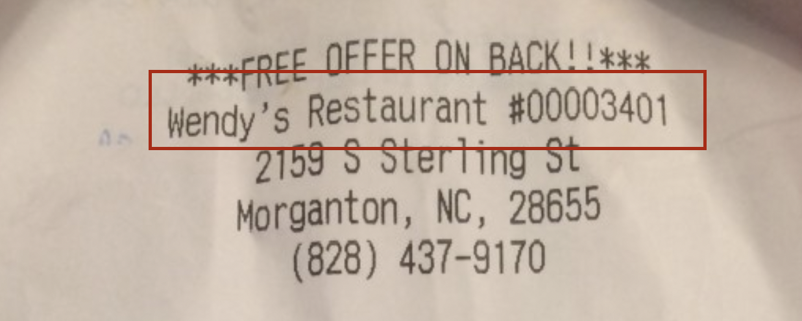

# Wendy Survey Automation

This script automates the survey process of any Wendy store of your choice and boost up the survey ratings.

## Installation


Use the package manager [pip](https://pip.pypa.io/en/stable/) to install what is necessary.

```bash
pip install -r requirements.txt
```

After, in the project directory create a file called `.env` and add the next line into the file:
```env
WENDY_CODE=XXXXX
```
_The X's represent the stores restaurant code that can be located below:_




## Usage 

python wendy.py

The validation code at the end will be pasted into output.txt.

## Contributing

I will not be accepting any pull request.

